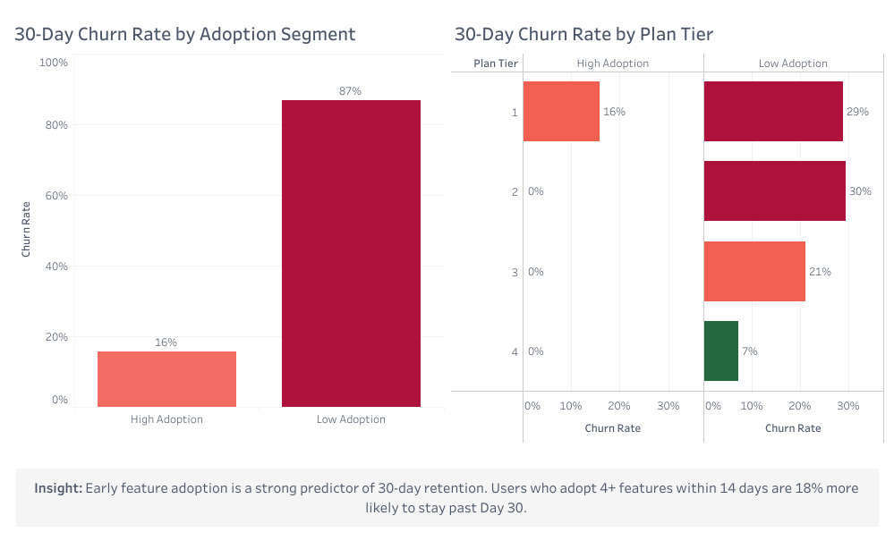
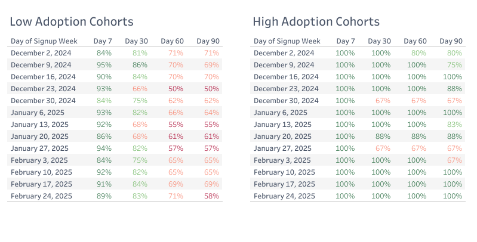
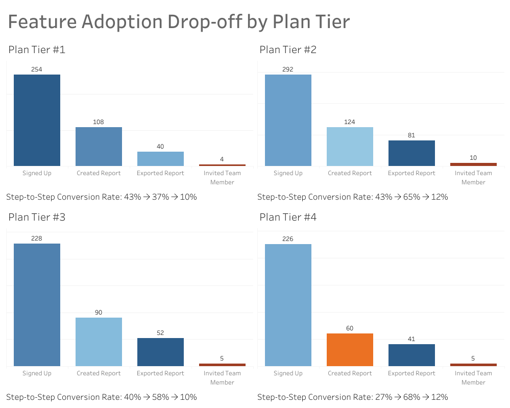

# SaaS Feature Adoption and Churn Analysis

A data analysis portfolio project investigating the relationship between early feature adoption and 30-day user retention in a B2B SaaS product.

**Note:** This project uses synthetic data.

## Project Overview

**The Business Problem**

A high-growth B2B SaaS company faces a critical question: Why do users churn after 30 days? The hypothesis is straightforward: users who don't adopt core features or engage with onboarding materials leave first.

**The Central Question:** Do users who adopt features early stay longer?

**The Answer:** Yes. High-adoption users have 15% lower churn at day 30 compared to low-adoption users (15% vs. 80% churn), and this pattern holds across all four subscription tiers (Tier 1 entry-level through Tier 4 highest-value customers).

---

## Key Findings

| Finding | Insight | Data Impact |
|---------|---------|-------------|
| High-adoption users churn at 15% | Users who adopt ≥3 distinct features within 14 days + view documentation = strong retention signal | Feature adoption is a measurable predictor of 30-day retention |
| Tier 4 paradox: 7% churn, 43% report creation adoption | High-value customers show lowest churn but steepest adoption drop-off | Users on the enterprise tier (Tier 4) show low churn (7%) regardless of whether they adopt core features early - unlike lower tiers, where early adoption strongly predicts retention |
| Cohort retention stability in high-adoption group | Retention flatlines near 100% through day 90 for high adopters | Early feature adoption creates sustained retention |
| Feature breadth matters more than individual actions | Users who try multiple core features stay longer than single-feature users | Multiple feature adoption is a stronger signal than any single action |

---

## Dashboard Results

### 30-Day Churn Rate by Adoption Segment and Plan Tier

High-adoption users show 15% churn and low-adoption users show 88% churn. Tier 4 has the lowest overall churn (low adoption users have 7% and high adoption users have 0%).



Data Source: [User Adoption Segments with 30/60/90-Day Churn Rates](./SQL/02_user_adoption_segments_churn.sql)

---

### Cohort Retention Heatmap

Retention rates (day 7→90) for high adoption vs. low adoption cohorts, segmented by signup week.



Data Source: [Cohort Retention Matrix](./SQL/03_cohort_retention_matrix.sql)

---

### Feature Adoption Funnel by Plan Tier

Drop-off rates at each step: signed up → created report → exported report → invited team member.



---

## Technical Approach

### Data Foundation

Synthetic dataset built with [Mockaroo](https://www.mockaroo.com/) and Excel:

- **users table:** user_id, signup_date, churn_date, plan_tier (1–4), status (active/canceled)
- **user_events table:** event_id, user_id, event_date, event_type (updated_settings, created_report, ran_dashboard_export, imported_report, applied_filter, invited_team_member, viewed_help_docs)

### SQL Transformation

Built user adoption segments using CTEs and window functions to calculate three retention predictors:

**Key Metrics**

- **Time-to-Value (TTV):** Days from signup to first core action
- **Feature Breadth:** Count of distinct features used in first 14 days
- **Documentation Interaction:** Binary flag (viewed help docs = 1, else 0)

**Segmentation Logic**
```
HIGH_ADOPTION = (TTV ≤ 7 days) AND (Feature_Breadth ≥ 3) AND (Viewed_Docs = 1)
LOW_ADOPTION = Everyone else
```

See [01_user_adoption_segments.sql](./SQL/01_user_adoption_segments.sql) for the full query.

### Tableau Dashboards

- **30-Day Churn Rate by Adoption Segment and Plan Tier**: Comparison of adoption segments and plan tiers
- **Cohort Retention Heatmap**: Week-over-week retention by signup cohort and adoption segment
- **Feature Adoption Funnel by Plan Tier**: Drop-off rates by plan tier

---

## Assumptions and Design Decisions

**Core Actions:** **created_report** and **invited_team_member** represent independent value (reporting) and expansion potential (team growth).

**14-Day Window:** Feature breadth is measured in the first 14 days - the period when behavioral patterns stabilize and early engagement becomes predictive of sustained platform usage.

**Documentation Interaction:** A user who views help documentation signals proactive engagement and is flagged as higher-intent than users who never access help resources.

**High-Adoption Threshold:** All three conditions must be met to isolate the most engaged cohort for comparison against everyone else.

**Synthetic Data:** Enables demonstration of SQL transformation, window functions, and analytical storytelling without proprietary data constraints.

### Why These Metrics?

**Time-to-Value (TTV) ≤ 7 Days**
- Users who reach their first core action within a week demonstrate early engagement
- Beyond 7 days, activation momentum typically fades in B2B SaaS
- This aligns with industry benchmarks for onboarding window length

**Feature Breadth ≥ 3 Distinct Features**
- Single-feature users rarely stay (they solve one problem and leave)
- Three features signal broader product exploration and value discovery
- Avoids false positives from users who stumble onto one feature by accident

**Documentation Interaction (Binary Flag)**
- Self-directed help-seeking indicates investment in the product
- Users who view docs have lower support burden and faster ramp
- Distinguishes active learners from passive or frustrated users

### Why High-Adoption Threshold Uses AND Logic

All three conditions must be met because:
- Time-to-Value (TTV) alone doesn't guarantee sustained engagement
- Breadth alone could reflect accidental discovery rather than intentional exploration
- Documentation alone doesn't guarantee feature use

Together, they identify users who actively *engaged* with the product, not just users who happened to take one action.

---

## The Tier 4 Paradox: What the Data Reveals

**The Pattern**
- Tier 4 (enterprise) has the lowest churn rate at 7%
- But only 43% of Tier 4 users create a report - lower than all other tiers (48-52%)
- This contradicts the strong correlation between feature adoption and retention seen in Tiers 1–3

**What This Suggests**

In Tiers 1–3, adoption rates and churn rates move together: high adoption → low churn.

In Tier 4, they diverge: low adoption → low churn.

Possible explanations for the data:
- **Contract lock-in:** Enterprise customers are contractually committed, so they don't churn even if disengaged
- **Different use case:** Enterprise buyers may have been sold on a specific (non-report) feature
- **Longer sales cycle:** Enterprise customers may still be in implementation and haven't reached "self-serve" usage yet
- **Data limitation:** Small sample size for Tier 4 may create statistical noise

**What This Does NOT Tell Us**
- Whether Tier 4 customers are *satisfied* (we only see churn, not NPS or renewal intent)
- Why adoption is lower (could be onboarding, product fit, or just account maturity stage)
- Whether this is sustainable (renewal risk may appear later, after the 90-day window)

---

## Key Observations

**Observation 1: Early Feature Adoption Predicts 30-Day Retention**
- High-adoption users: 15% churn
- Low-adoption users: 80% churn
- The data shows a strong correlation between multi-feature engagement and staying past day 30

**Observation 2: The Tier 4 Paradox Suggests Contract Structure Matters**
- Enterprise customers don't churn even with low feature adoption
- This could mean contract lock-in masks actual disengagement
- Or it could mean enterprise onboarding/use cases differ from SMB products

**Observation 3: Team Invitations Are the Leakiest Funnel Stage**
- Only 10-17% of users across all tiers invite teammates
- This is the lowest adoption rate among core actions
- Could indicate friction, permission/license constraints, or unclear value

---

## Questions for Further Analysis

- Does the Tier 4 churn rate hold after day 90? (Is the paradox short-term or sustained?)
- What percentage of Tier 4 users are still in "implementation" phase during the first 30 days?
- How do usage patterns differ between Tier 4 adopters (43%) and non-adopters (57%)?
- Are team invitations blocked by license limits, or is adoption driven by user intent?

---

## Repository Structure

├── README.md
├── assumptions.md
├── sql/
│   └── user_activity_profile.sql
├── data/
│   ├── users.csv
│   └── user_events.csv
├── assets/
│   ├── cohort_retention_heatmap.png
│   ├── 30day_churn_by_adoption_tier.png
│   └── feature_adoption_funnel.png
└── dashboards/
├── cohort_retention_heatmap.twbx
├── 30day_churn_by_adoption.twbx
└── feature_adoption_funnel.twbx


