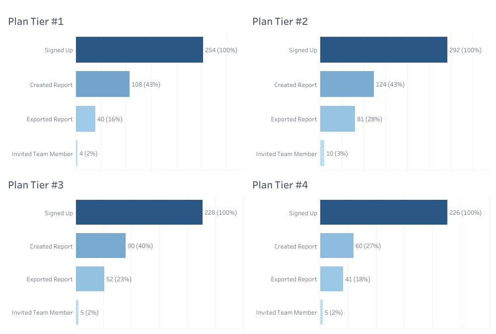

# SaaS Feature Adoption and Churn Analysis

A data analysis portfolio project investigating the relationship between early feature adoption and 30-day user retention in a hypothetical B2B SaaS analytics platform where users create, share, and collaborate on reports.

**Note:** This project uses synthetic data.

## Project Overview

**The Business Problem**

A high-growth B2B SaaS analytics company faces a critical question: Why do users churn after 30 days? The hypothesis is straightforward: users who don't adopt core features leave first.

---

## Key Findings

| Finding | Insight | Data Impact |
|---------|---------|-------------|
| High adoption users churn at 13% (first core action ≤7 days and ≥4 features within 14 days) | Users who engage early and broadly = strong retention signal | Feature adoption is a measurable predictor of 30-day retention |
| Tier 4 users have 7% churn in the low adoption segment and 0% churn in the high adoption segment. Yet only 27% ever created a report in their first 30 days (compared to 37-40% for Tiers 1–3). | Enterprise contracts (Tier 4) mask adoption risk: adoption still predicts churn, but contractual commitment suppresses 30-day signals. | Longer measurement windows (day 90+) are needed to detect Tier 4 retention risk, but the adoption-churn link still holds across all tiers. |
| Cohort retention stability in high adoption group | High adopters churn slower than low adopters and the gap widens over time | Early feature adoption creates sustained retention |
| Feature breadth matters more than individual actions | Users who try multiple core features stay longer than single-feature users | Multiple feature adoption is a stronger signal than any single action |

---

## Dashboard Results

### 30-Day Churn Rate by Adoption Segment and Plan Tier

High adoption users show 13% churn and low adoption users show 87% churn. 

Tier 4 has the lowest overall churn (7% for low adoption users, 0% for high adoption users).


Data Source: [01_user_adoption_segments_churn.sql](./SQL/01_user_adoption_segments_churn.sql)

---

### Cohort Retention Heatmap

Retention rates (day 7→90) for high adoption vs. low adoption cohorts, segmented by signup week. 

High adopters churn slower than low adopters and the gap widens over time.


Data Source: [02_cohort_retention_matrix.sql](./SQL/02_cohort_retention_matrix.sql)

---

### Feature Adoption Rates from Baseline by Plan Tier

Counts and percentage of the total signup cohort that ever successfully activates each feature within 30 days. 

Across all tiers, a maximum of 3% of cohorts engage with the team member invitation feature.



Data Source: [03_feature_adoption_rates.sql](./SQL/03_feature_adoption_rates.sql)

---

## Technical Approach

### Data Foundation

Synthetic dataset built with [Mockaroo](https://www.mockaroo.com/) and Excel:

- **users table:** `user_id`, `signup_date`, `churn_date`, `plan_tier` (1–4), `status` (active/canceled)
- **user_events table:** `event_id`, `user_id`, `event_date`, `event_type` (`created_report`, `imported_report`, `applied_filter`, `updated_settings`, `ran_dashboard_export`, `invited_team_member`, `shared_report`)

### Feature Categories

| Feature Category | Actions | Value |
|---|---|---|
| Ingestion & Core Value | `created_report`, `imported_report` | User gets data in and generates first insights |
| Deep Engagement | `applied_filter`, `updated_settings`, `ran_dashboard_export` | User explores, customizes, and extracts value |
| Collaboration & Amplification | `invited_team_member`, `shared_report` | User multiplies impact by bringing others in |


### SQL (Postgres) Transformation

**Key Metrics**

- **Time-to-Value (TTV):** Days from signup to first core action (`created_report` or `imported_report`)
- **Feature Breadth:** Count of distinct features used in first 14 days

**Segmentation Logic**
```
High Adoption = (TTV ≤ 7 days) AND (Feature Breadth ≥ 4 within 14 days)
Low Adoption = Everyone else
```

### SQL Techniques

- **CTEs with JOINs:** Connect user events to signup/churn data for Time-to-Value and feature breadth calculations
- **Temporal Filtering (JOIN conditions and CASE logic)** Event data constrained to 7-day, 14-day, and 30-day windows post-signup to isolate early engagement signals and measure Time-to-Value and retention patterns
- **Window Function (FIRST_VALUE):** Establish the signup baseline per tier for adoption rate calculations

---

# Design Rationale

## Why These Metrics Matter

Early feature adoption is a leading indicator of long-term retention in B2B SaaS. But "adoption" is vague. This project operationalizes the concept using two measurable signals that together identify genuinely engaged users:

### Time-to-Value (TTV): Days from Signup to First Core Action

- Users who reach their first core action within 7 days demonstrate early engagement momentum
- Beyond 7 days, activation typically fades. This aligns with industry benchmarks for onboarding window length
- TTV alone doesn't guarantee sustained engagement, but it's a necessary first signal

### Feature Breadth: Count of Distinct Features Used in First 14 Days

- Single-feature users rarely stay (they solve one problem and leave)
- Four features signal genuine product exploration, not accidental discovery
- 14-day window chosen because behavioral patterns stabilize by this point - engagement becomes predictive of sustained platform usage

## Why Two Conditions Together (AND Logic)

Each metric alone is incomplete:

- TTV alone misses users who take one action and disappear
- Breadth alone could reflect accidental clicks rather than intentional exploration

Combined, they isolate users who actively engaged with the product across these two dimensions - not just users who happened to take one action.

## Design Choice: Synthetic Data

This project uses synthetic data. This choice enables demonstration of SQL transformation, window functions, and analytical storytelling without proprietary data constraints. The logic and insights generalize to real-world SaaS datasets.

---

## The Tier 4 Pattern: Lower Churn Despite Lower Early Adoption

**The Pattern**
- Tier 4 (enterprise) has the lowest churn rate at 0–7% across both high and low adoption segments
- Yet only 27% of Tier 4 users create a report in the first 30 days - lower than Tiers 1–3 (37–43%)
- Tier 4 users show the highest proportion of imported report actions (20%), suggesting a different onboarding pattern

**What This Suggests**

Selection effect and contract structure likely explain the divergence. Tier 4 buyers are vetted by sales and contractually committed, so early feature adoption is less predictive of their 30-day churn. Additionally, Tier 4 users may prioritize importing existing reports over creating new ones - a more efficient onboarding path that still demonstrates product engagement.
  
**What This Does NOT Tell Us**
- Whether Tier 4 customers are satisfied (we only see churn, not NPS or renewal intent)
- Why adoption patterns differ (could be onboarding design, use case fit, or deliberate strategy around importing vs. creating)
- Whether this is sustainable (renewal risk may appear later, after the 90-day window)

---

## Key Observations

**Observation 1: Early Feature Adoption Predicts 30-Day Retention**
- High adoption users: 13% churn
- Low adoption users: 87% churn
- The data shows a strong correlation between multi-feature engagement and staying past day 30

**Observation 2: Contract Structure and Sales Vetting Shape Early Retention**
- Enterprise customers (Tier 4) show minimal churn (0–7%) regardless of early feature adoption levels.
- This suggests that sales vetting and contractual commitment reduce churn pressure in the first 30 days, making early feature adoption a weaker retention signal for Tier 4 compared to lower tiers.

**Observation 3: Team Adoption Represents a Critical Engagement Gap**
- A healthy B2B collaboration platform typically achieves 15–25% team adoption within 30 days. This dataset shows minimal viral feature adoption: fewer than 4% of total users across all tiers invite a teammate, suggesting the platform functions primarily as a single-user tool despite higher report-sharing rates (20-27%).

---

## Questions for Further Analysis

- Does the Tier 4 churn rate hold after day 90? (Is the paradox short-term or sustained?)
- How do usage patterns differ between Tier 4 users who created reports (27%) and those who didn't (73%)?

---

## Repository Structure

The repository includes a synthetic dataset (`users.csv`, `user_events.csv`), four SQL (Postgres) queries that calculate adoption segments and retention metrics, and three Tableau visualizations exported as PNGs.
